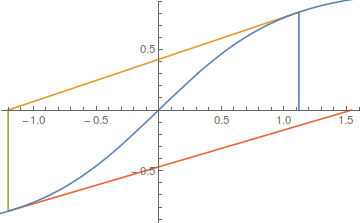

## Exercise 1.6

The function $f(x) = \tanh x$ has a root at $x=0$. Write a program to show that the Newton-Raphson method does not converge for an initial guess of $x\gtrsim1$. Can you understand what's going wrong by considering a graph of $\tanh x$? From the explicit form of (1.14) for this problem, derive the critical value of the initial guess above which convergence will not occur. Try to solve the problem using the secant method. What happens for various initial guesses if you try to find the $x=0$ root of $\tan x$ using other methods?

### Solution

From my intuition, as well as the symmetric property of $\tanh x$, the critical initial guess for this specific problem for Newton-Raphson method should be:
\[
x_1 = -x_0 = x_0 - \frac{\tanh x_0}{\tanh' x_0}
\]
Solving this equation gives $x_0 \sim \pm1.08866$. If $x_0$ is greater than this value, the Newton-Raphson method fails quickly. It is apparent that secant method converges well if the two initial guess points are separated by the $y$ axis.

The figure above renders the situation that $x_0=1.12$. It is apparent that the third guess is greater than the first guess. It is predictable that the absolute value of future guesses gets larger and larger.

If we are solving the root of $\tan x$, Newton-Ramphson method converges to the nearest root, while the secant method gives the root almost unpredictably.
