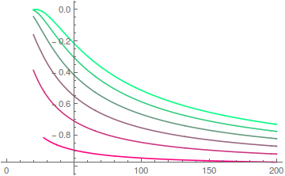

## Exercise 1.11

Plot the $\varepsilon_n$ of the Lennard-Jones potential as functions of $\gamma$ for $\gamma$ running from $20$ to $200$ and interpret the results.

### Solution

The following graph is plotted by Mathematica. For example, if we want to plot the first state energy, we can input the following code:
```Mathematica
Plot[
 e /. FindRoot[\[Gamma] NIntegrate[
       (e - 4. (x^(-12.) - x^(-6.)))^0.5,
       {x,
        ((Sqrt[1. + e] - 1.)/(0.5 e))^(1./6.),
        ((-Sqrt[1. + e] - 1.)/(0.5 e))^(1./6.)}
       ]/Pi == 0.5, {e, -0.5}]
 , {\[Gamma], 20, 200}]
```

The graph for the lowest six energy levels shows as the following: (though there's lots of corrupted discontinuous)


