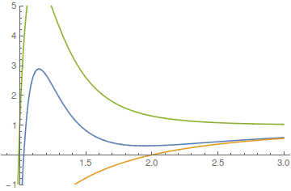

# Project I

## Fundamental Calculation Conceptions

The calculation method is:
\[
\Theta(b) = \int_b^{r_\mathrm{max}} \frac{2b \, \mathrm d r}{r^2} \biggl( 1 - \frac{b^2}{r^2} \biggr)^{-1/2} -
\int_{r_\mathrm{min}}^{r_\mathrm{max}} \frac{2b \, \mathrm d r}{r^2} \biggl( 1 - \frac{b^2}{r^2} - \frac{v(r)}{e} \biggr)^{-1/2}
\]
where
* $r$ and $b$ are the scaled (by Bohr radius $a$) distance and impact factor;
* $e$ is the scaled energy (by the lowest point of the potential $V_0$);
* $v(r)$ is the scaled potential (also by $V_0$); the formula of the Lennard-Jones potential is
\[
v(r) = 4 \big( r^{-12} - r^{-6} \big)
\]
* $r_\mathrm{max}$ is defined manually (scaled by Bohr radius $a$); it should be infinity in principle, however, that is out of our capability to manipulate an integral with it's upper limit be the infinity. It is said to be almost save to set $r_\mathrm{max}$ be $3$; however, I believe it is inadequate in most cases since $b$ can be larger than $r_\mathrm{max}$.
* $r_\mathrm{min}$ is defined by the domain of the following function (which domain is almost the same as the integral core):
\[
f_c(r) = 1 - \frac{b^2}{r^2} - \frac{v(r)}{e}
\]
\[
f_c(r_\mathrm{min}) = 0
\]
* It's very likely to have many roots for the equation, what we want is the greatest root of the equation.

For the FORTRAN code, $e$ is defined at the common block, and won't be called as a variable.

## Mathematica Code for the Fundamental Calculation

This following code shows how the basic calculation of the scattering angle can be calculated:
```Mathematica
e = 0.1; b = 2.258; rmax = 100000;
FuncC[r_] := b*r^-2*(1 - b^2*r^-2 - 4/e*(r^-12 - r^-6))^(-1/2)
```
```Mathematica
rmin = x /.
  NSolve[FuncC[x]^(-1) == 0 && Re[x] > 0 && Abs[Im[x]] < 10^-8, x][[1]]
```
```Mathematica
(2 NIntegrate[b/r^2*(1 - b^2/r^2)^(-1/2), {r, b, rmax}])/
   Pi*180 - (NIntegrate[FuncC[r], {r, rmin, rmax}])/Pi*180
```

## If the Potential be the Square Potential?

To start any discussion, we should first observe the behavior of the integral core $f_c(r)$ as defined before.

These following figures are taken under the situation that $r_\mathrm{max} = 2.0$ (here the $r_\mathrm{min}$ does not means the integral upper limit, but the maximum distance the potential $v(r) = u_0$ can affect).


The first figure is obtained at $e=-0.5$, and the three curves are obtained at $b= 1.6,2.0,2.4$ (from top to bottom). $x$ axis refers to $r$, while $y$ axis refers to $f_c(r)$. This figure somehow looks like the situation when Lennard-Jones potential is applied and $e$ is small. For $b=2.0$, the electron is "trapped" by the particle and electron orbital merges, as well as $\Theta$ is extremely negative (actually it's a singularity). When $b$ becomes larger or smaller than $2.0$, the value of $\Theta$ becomes larger, and finally converges to $Pi$ (for $b \rightarrow 0$) or $0$ (for $b \rightarrow +\infty$).


The first figure is obtained at $e=2.0$, and the three curves are obtained at $b= 1.0,1.5,2.0$ (from top to bottom).

Since there are only one possible root for $f_c(r)=0$, the situation is much more simpler than the former situation.

## "Trap" by Central Particle

For a low energy $e$, it is possible to let the electron be "trapped", forming an orbital around the central particle. This situation can happen when there are one minimum for $f_c(r)$ which is slightly **above** zero (but not slightly below zero!). Here's a figure that should explain what happens:


This figure is obtained at $e=0.5$, $b=1.91$, Lennard-Jones potential. From this figure, we know that $r_\mathrm{min} \sim 1.19$, so $r=1.54$ should be included by the integral; however, $f_c(1.54)$ is just slightly above zero, so the integral core
\[
\frac{2b}{r^2} \biggl( 1 - \frac{b^2}{r^2} - \frac{v(r)}{e} \biggr)^{-1/2} \rightarrow +\infty
\]
Since the integral of the integral core mentioned above is subtracted by
\[
\pi \sim \int_b^{r_\mathrm{max}} \frac{2b \, \mathrm d r}{r^2} \biggl( 1 - \frac{b^2}{r^2} \biggr)^{-1/2}
\]
so the value of $\Theta$ can be extremely small. The extremely small $\Theta$ implies that the electron have to rotate around the central particle for several times before it leaves the particle and depart to infinity.


## Where is the singularity of the "trap"?

Our problem is that provided a small $e$, find the $b$ as well as $r$ which satisfies the singularity condition; this condition is
\[
\begin{align}
f_c(r) &= 1 - \frac{b^2}{r^2} + \frac 1 e (- 4 r^{-12} + 4 r^{-6}) = 0 \\
f'_ c(r) &= \frac{2 b^2}{r^3} + \frac 1 e (48 r^{-13} - 24 r^{-7}) = 0 \\
f''_ c(r) &= - \frac{b^2}{r^4} + \frac 1 e (-624 r^{-14} + 168 r^{-8}) > 0
\end{align}
\]

First we solve $r$:
\[
f_c(r) + \frac r 2 f'_ c(r) = \frac{e r^{12} - 8 r^6 + 20}{e \, r^{12}} = 0
\]
The only positive roots are
\[
r_1 = \left( \frac{4 - 2 \sqrt{4 - 5e}}{e} \right)^{1/6} \;, \qquad r_2 = \left( \frac{4 + 2 \sqrt{4 - 5e}}{e} \right)^{1/6}
\]

Actually we know that only one root is correct. The last condition tells us that
\[
f''_ c(r) + \frac 3 r f'_ c(r) = \frac{96}{e \, r^{14}} (-5 + r^6) > 0
\]
so $r > 5^{1/6}$. So $r_1$ is unqualified for this condition:
\[
\begin{align}
r_1^6 &= \frac{4 - 2 \sqrt{4 - 5e}}{e} = \frac{4 - 2 \sqrt{4 - 5e}}{e} \cdot \frac{4 + 2 \sqrt{4 - 5e}}{4 + 2 \sqrt{4 - 5e}} \\
&= \frac{20e}{e (4 + 2 \sqrt{4 - 5e})} < \frac{20}{4+0} = 5
\end{align}
\]
By the same way, we know that $r=r_2$ is the only root qualified for the last condition provided.

We then substitute $r=r_2$ into the first condition to give $b$. The only positive root expression of $b$ is something awful:
\[
b_\mathrm{crit} = \frac{2^{2/3} 3^{1/2}}{5} \left( \frac{2 + \sqrt{4-5e}}{e} \right)^{1/6} \left( \frac{2- \sqrt{4-5e}+5e}{e} \right)^{1/2}
\]

From the solutions mentioned above, only when
\[
0 < e < \frac 4 5
\]
can the central particle "trap" be formed.

## Programming Notes

### Way to predict roots

It is almost impossible to predict any positive roots for the equation
\[
f_c(r) = 0
\]
However, we can predict roots by omitting several terms in $f_c(r) = 0$. If $r$ is large enough, then we consider $4e^{-1} (r^{-12} - r^{-6})$ is quite small:
\[
f_c(r)\sim 1- \frac{b^2}{r^2}
\]
The positive root for the equation above is $r_{02} = b$. From our intuition, we know that for $r>b$, $f_c(r)$ have no maximum or minimum points; so if there is any root near $b$, we can take $r = b$ for the initial point to guess the location of root for the Newton-Ramphson method, or $r_1 = b$ and $r_2 = b+\varepsilon$ for the secant method.

If $r$ is small enough, then the contribution of $b^2 / r^2$, big may it be, is not as significant as $4e^{-1} (r^{-12} - r^{-6})$. Then we simply omit $b^2 / r^2$:
\[
f_c(r) \sim 1+ \frac 4 e \left( \frac{1}{r^{12}} - \frac{1}{r^6} \right) > f_c(r)
\]
The positive root for this equation is
\[
r_{12-06} = \left( \frac{2}{1 + \sqrt{1+e}} \right)^{1/6} < 1
\]
It's apparent that $f'_ c(r) > 0$ for $r_{12-06} < r < 1$. It's appropriate to use either secant, Newton-Ramphson or search method to find root when the initial guess is at $1$ or $r_{12-06}$.

### Adopt the initial guess appropriately

Generally speaking, there're two possible trend for the curve of $f_c(r)$: constantly increasing or decreasing just in a quite small interval. If the curve is constantly increasing, either use $r_{02}$ or $r_{12-06}$ is acceptable; however, if the curve is not constantly increasing, we have to reconsider which guess is more appropriate.

For situation that $e \leq 0.75$, if $b<b_\mathrm{crit}$, then the root should near $r_{12-06}$:



(where $e = 0.2$, $b = 2.0$)

If $b>b_\mathrm{crit}$, then the root should near $r_{02}$, as well as the root should larger than $r_\mathrm{crit}$:


(where $e = 0.2$, $b = 2.4$)

So we can identify the root search procedure by the position of $b$ against $b_\mathrm{crit}$ when $e \leq 0.75$ exactly.

However, if $e > 0.75$, then the situation cannot be determined analytically, since we can't tell the exact condition that $f_c(r)$ increases constantly, I believe we can just try which root is more appropriate to solve the equation; and if we tried one that cannot work, we just try another one. I think that the guess of $r = r_{02}$ is more appropriate for $b > 2^{1/6}$ (as the critical point $b_\mathrm{crit}$ when $e = 0.75$), and the guess $r = r_{12-06}$ *vise versa* .

### Integrate a function that has a cusp at $r_\mathrm{min}$

The functions we integrate have cusps at $r_\min$. The way we annihilate these annoying cusps is to change the integral variable. For example, if we define $u = \sqrt{r-b}$, then we have $\mathrm{d}r = 2u\,\mathrm{d} u$, as well as
\[
\int_{b}^{r_\max} \frac{2b}{r^2} \left( 1- \frac{b^2}{r^2} \right)^{-1/2} \mathrm{d} r =
\int_{0}^\sqrt{r_\max - b} \frac{4b}{r^2} \left( \frac{r+b}{r^2} \right)^{-1/2} \mathrm{d} u
\]
Then the integral core is not infinite at the integral lower limit. This integral transformation is called "rectangle method". It's beneficial for us to deal with this integral in this way not only because we can successfully annihilate the cusp in the integral core, but also in that we can deal the integral near $b$, where the value of the integral core is quite large, more delicately, as well as deal the integral near $r_\max$, where the value of the integral core is small, more coarsely.

Of course we can deal with another integral similarly (with $u = \sqrt{r - r_\min}$):
\[
\int_{r_\min}^{r_\max} \frac{2b}{r^2} \left( 1- \frac{b^2}{r^2} + \frac{4}{e} (r^{-12} - r^{-6}) \right)^{-1/2} \mathrm{d} r =

\int_{0}^\sqrt{r_\max - r_\min} \frac{4b}{r^2} \left( \frac{1- \frac{b^2}{r^2} + \frac{4}{e} (r^{-12} - r^{-6})}{r - r_\min} \right)^{-1/2} \mathrm{d} u
\]
The integral core is apparently bounded, however, we cannot get the analytical expression immediately, since the integral core is not so easy to be fractionated. It's very likely that when $r$ is very close to $r_\min$, the integral core cannot be calculated correctly for the numerical failure. If we consider that this situation is very likely to happen (when $f_c(r)$ is very close to zero or even slightly smaller than zero), we have to calculate the integral core in an alternative way.

Of course to omit them in calculating integral is one possible way, since if we have a really large integral grid number, the number of pathological integral core values can be relatively small; however we may have another way to approximate the integral core value near $r_\min$ other than simply omitting. By applying l'Hospital's rule, we know that if we define $t = r - r_\min$,
\[
\lim_{t \rightarrow 0} \frac{1- \frac{b^2}{r^2} + \frac{4}{e} (r^{-12} - r^{-6})}{t} =
\left. \frac{\partial_t \left( 1- \frac{b^2}{r^2} + \frac{4}{e} (r^{-12} - r^{-6}) \right)}{\partial_t t} \right\vert_{t \rightarrow 0} = f'_ c(r_\min)
\]
So we can replace the possible pathological division by $f'_ c(r_\min)$ instead.
